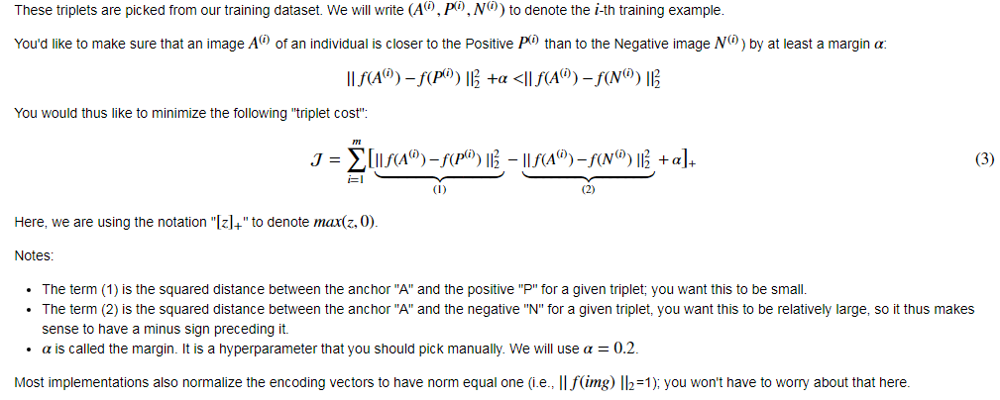

# Face-Recognition

Face recognition problems commonly fall into two categories:

- **Face Verification - "is this the claimed person?"** : For example, at some airports, you can pass through customs by letting a system scan your passport and then verifying that you (the person carrying the passport) are the correct person. A mobile phone that unlocks using your face is also using face verification. This is a 1:1 matching problem.

- **Face Recognition - "who is this person?"** : For example, the video lecture showed a face recognition video (https://www.youtube.com/watch?v=wr4rx0Spihs) of Baidu employees entering the office without needing to otherwise identify themselves. This is a 1:K matching problem.

FaceNet learns a neural network that encodes a face image into a vector of 128 numbers. By comparing two such vectors, you can then determine if two pictures are of the same person.

**In this project, we will:**
- Implement the triplet loss function
- Use a pretrained model to map face images into 128-dimensional encodings
- Use these encodings to perform face verification and face recognition 

In this exercise, we will be using a pre-trained model which represents ConvNet activations using a "channels first" convention, as opposed to the "channels last" convention. In other words, a batch of images will be of shape __*(m, n_C, n_H, n_W)*__ instead of __*(m, n_H, n_W, n_C)*__.

***

## 0 - Naive Face Verification

In Face Verification, you're given two images and you have to tell if they are of the same person. The simplest way to do this is to compare the two images pixel-by-pixel. If the distance between the raw images are less than a chosen threshold, it may be the same person! 

Of course, this algorithm performs really poorly, since the pixel values change dramatically due to variations in lighting, orientation of the person's face, even minor changes in head position, and so on.

You'll see that rather than using the raw image, you can learn an encoding  __*f(img)*__ so that element-wise comparisons of this encoding gives more accurate judgements as to whether two pictures are of the same person.

## 1 - Encoding face images into a 128-dimensional vector 

### 1.1 - Using an ConvNet  to compute encodings

The FaceNet model takes a lot of data and a long time to train. So following common practice in applied deep learning settings, let's just load weights that someone else has already trained. The network architecture follows the Inception model from [Szegedy *et al.*](https://arxiv.org/abs/1409.4842). We have provided an inception network implementation. You can look in the file `inception_blocks.py` to see how it is implemented.  

The key things we need to know are:
- This network uses 96x96 dimensional RGB images as its input. Specifically, inputs a face image (or batch of __*m*__ face images) as a tensor of shape __*(m, n_C, n_H, n_W) = (m, 3, 96, 96)*__ 
- It outputs a matrix of shape __*(m, 128)*__ that encodes each input face image into a 128-dimensional vector

By using a 128-neuron fully connected layer as its last layer, the model ensures that the output is an encoding vector of size 128. You then use the encodings the compare two face images as follows:

<strong>By computing a distance between two encodings and thresholding, you can determine if the two pictures represent the same person</strong>

So, an encoding is a good one if: 
- The encodings of two images of the same person are quite similar to each other 
- The encodings of two images of different persons are very different

The triplet loss function formalizes this, and tries to "push" the encodings of two images of the same person (Anchor and Positive) closer together, while "pulling" the encodings of two images of different persons (Anchor, Negative) further apart. 

 

<strong>In the next part, we will call the pictures from left to right: Anchor (A), Positive (P), Negative (N)</strong>

### 1.2 - The Triplet Loss

For an image **x**, we denote its encoding **f(x)**, where **f** is the function computed by the neural network.

<!--
We will also add a normalization step at the end of our model so that $\mid \mid f(x) \mid \mid_2 = 1$ (means the vector of encoding should be of norm 1).
!-->

Training will use triplets of images **(A, P, N)**:  

- A is an "Anchor" image--a picture of a person. 
- P is a "Positive" image--a picture of the same person as the Anchor image.
- N is a "Negative" image--a picture of a different person than the Anchor image.

## 2 - Loading the trained model

FaceNet is trained by minimizing the triplet loss. But since training requires a lot of data and a lot of computation, we won't train it from scratch here. Instead, we load a previously trained model.

Here're some examples of distances between the encodings between three individuals:

 

<strong>Example of distance outputs between three individuals' encodings</strong>

## 3 - Applying the model

Back to the Happy House! Residents are living blissfully since we implemented happiness recognition for the house in an earlier assignment.  

However, several issues keep coming up: The Happy House became so happy that every happy person in the neighborhood is coming to hang out in your living room. It is getting really crowded, which is having a negative impact on the residents of the house. All these random happy people are also eating all your food. 

So, we decide to change the door entry policy, and not just let random happy people enter anymore, even if they are happy! Instead, we'd like to build a **Face verification** system so as to only let people from a specified list come in. To get admitted, each person has to swipe an ID card (identification card) to identify themselves at the door. The face recognition system then checks that they are who they claim to be. 

### 3.1 - Face Verification

Let's build a database containing one encoding vector for each person allowed to enter the happy house. To generate the encoding we use `img_to_encoding(image_path, model)` which basically runs the forward propagation of the model on the specified image.
This database maps each person's name to a 128-dimensional encoding of their face.

Now, when someone shows up at your front door and swipes their ID card (thus giving you their name), you can look up their encoding in the database, and use it to check if the person standing at the front door matches the name on the ID.

### 3.2 - Face Recognition

Our face verification system is mostly working well. But since Kian got his ID card stolen, when he came back to the house that evening he couldn't get in! 

To reduce such shenanigans, we'd like to change our face verification system to a face recognition system. This way, no one has to carry an ID card anymore. An authorized person can just walk up to the house, and the front door will unlock for them! 

We'll implement a face recognition system that takes as input an image, and figures out if it is one of the authorized persons (and if so, who). Unlike the previous face verification system, we will no longer get a person's name as another input. 

***
## Future Implementation:
- Put more images of each person (under different lighting conditions, taken on different days, etc.) into the database. Then given a new image, compare the new face to multiple pictures of the person. This would increase accuracy.
- Crop the images to just contain the face, and less of the "border" region around the face. This preprocessing removes some of the irrelevant pixels around the face, and also makes the algorithm more robust.
***
**What we should remember**:
- Face verification solves an easier 1:1 matching problem; face recognition addresses a harder 1:K matching problem. 
- The triplet loss is an effective loss function for training a neural network to learn an encoding of a face image.
- The same encoding can be used for verification and recognition. Measuring distances between two images' encodings allows you to determine whether they are pictures of the same person. 
***
### References:

- Florian Schroff, Dmitry Kalenichenko, James Philbin (2015). [FaceNet: A Unified Embedding for Face Recognition and Clustering](https://arxiv.org/pdf/1503.03832.pdf)
- Yaniv Taigman, Ming Yang, Marc'Aurelio Ranzato, Lior Wolf (2014). [DeepFace: Closing the gap to human-level performance in face verification](https://research.fb.com/wp-content/uploads/2016/11/deepface-closing-the-gap-to-human-level-performance-in-face-verification.pdf) 
- The pretrained model we use is inspired by Victor Sy Wang's implementation and was loaded using his code: https://github.com/iwantooxxoox/Keras-OpenFace.
- Our implementation also took a lot of inspiration from the official FaceNet github repository: https://github.com/davidsandberg/facenet 
